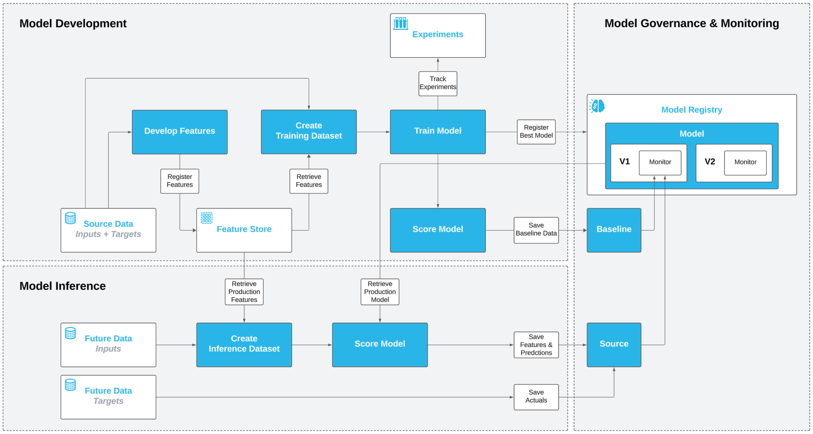

# Predictive Maintenance MLOps Demo

An end-to-end MLOps workflow for IoT predictive maintenance using Snowflake's native ML platform.

## Overview

Build a machine learning solution that predicts equipment failures before they happen using sensor data from industrial machines. The demo walks through the entire ML lifecycle—from data exploration to production deployment with monitoring.

## Requirements
This demo assumes that you have setup your environment using the `environment.setup.sql`.

## Architecture


## Key Snowflake ML Features Demonstrated

| Feature | Description |
|---------|-------------|
| **Feature Store** | Centralized feature management with automated incremental refresh |
| **Model Registry** | Version-controlled model storage with lineage tracking |
| **Experiment Tracking** | MLflow-style experiment logging with metrics comparison |
| **Model Monitoring** | Automated drift detection and performance tracking |
| **SPCS Deployment** | Containerized model inference with REST API endpoints |

## Workflow Steps

1. **Setup** — Initialize Feature Store and Model Registry
2. **Data Exploration** — Visualize sensor time-series data with Plotly
3. **Feature Engineering** — Create lag features using Snowpark Analytics
4. **Feature Registration** — Store features in Feature Store with auto-refresh
5. **Dataset Generation** — Point-in-time correct training data retrieval
6. **Model Training** — Train XGBoost with experiment tracking
7. **Model Registration** — Log model with signatures and metrics
8. **Production Deployment** — Set production alias for model versioning
9. **Model Testing** — Validate predictions on test data
10. **Model Monitoring** — Configure drift detection and performance alerts
11. **Drift Simulation** — Generate data with feature drift to trigger alerts
12. **Model Retraining** — Train new model version on recent data
13. **SPCS Deployment** — Deploy as containerized inference service
14. **REST API Inference** — Call model via HTTP with programmatic access tokens

## Prerequisites

- Snowflake account with ML features enabled
- Warehouse: `AI_WH`
- Database: `AI_DEMOS`
- Required privileges for Feature Store, Model Registry, and SPCS

## Quick Start

Open the notebook in Snowsight: `notebooks/end-2-end-mlops-demo.ipynb`

## Project Structure

```
predictive-maintenance-mlops-demo/
├── notebooks/
│   └── end-2-end-mlops-demo.ipynb    # Main demo notebook
├── src/
│   └── demo_functions/
│       ├── __init__.py
│       ├── demo_flow.py              # Data generation and setup utilities
│       └── plotting.py               # Plotly visualization functions
├── pyproject.toml                    # Package dependencies
└── README.md
```

## Sample Use Case

**Scenario:** A manufacturing facility monitors 200 machines with 3 sensors each. The goal is to predict equipment failures 1 day in advance to enable proactive maintenance.

**Data Pattern:**
- Normal operation: Sensor values between 0-1
- Pre-failure drift: Sensor values shift to 1-3 range
- Failure events: Occur 3-4 days after anomaly patterns begin